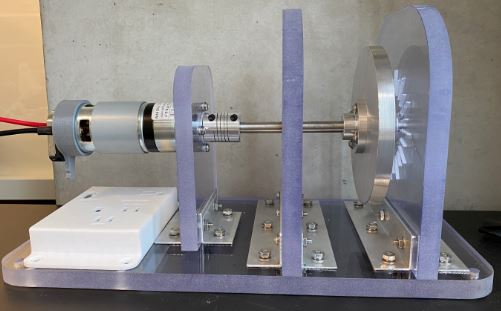
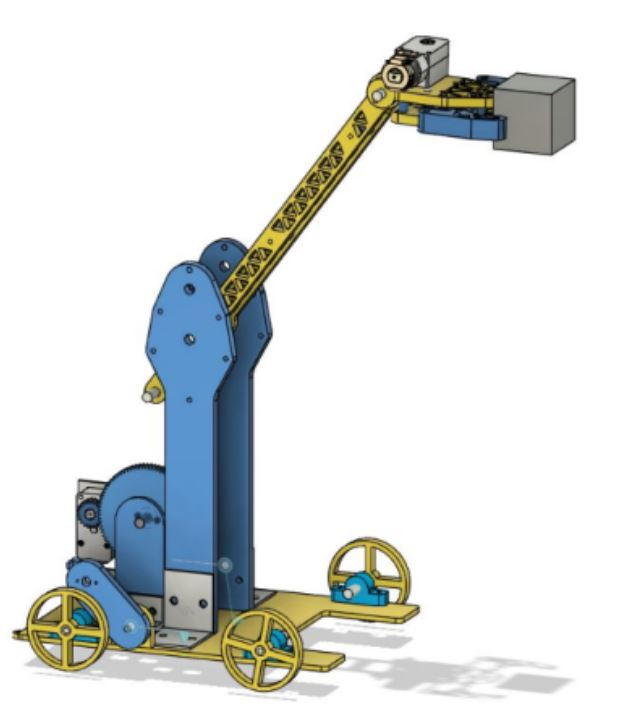
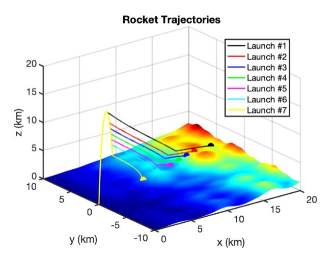
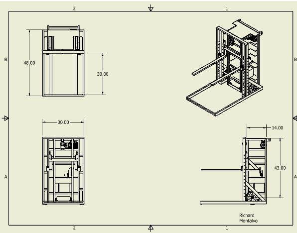

<!DOCTYPE html>
<html>
<head>
    <title>Richard Montalvo Portfolio</title>
    
</head>
<body>
    <header>
        <h1>Richard M. Portfolio</h1>
    </header>
    

        <h2>About Me</h2>
        
 Hello, I'm Richard Montalvo, a dedicated Mechanical Engineer in the making, driven by a profound passion for engineering and robotics. As an aspiring mechanical engineer, I bring to the table 
            demonstrated technical and analytical skills, with a strong desire to further expand my understanding of mechanical processes, practices, and concepts. 
            Here's a glimpse of the projects I've had the privilege to work on:

        
        <h2>Projects</h2>

        <h3>Project 1: Fly Wheel Controls</h3>
        
        

            <strong>Duration:</strong> January 2023 - March 2023 
            <strong>Description:</strong> This project aims to design a flywheel mechanism control system that maintains a desired speed or position. The controllers are to maintain the flywheel's position, velocity, and acceleration within acceptable limits. 
            <strong>Role:</strong> Controller Selection, Data Analysis, Testing and Calibration, Documentation 
            <strong>Skills Demonstrated:</strong> Control Systems Engineering, Mathematical Modeling, Controller Design and Implementation, Programming Skills, Experimental Testing, and Data Analysis. 
            <strong>Results:</strong> Allowed for advancement in controller design, improved system performance, and deeper understanding of control theory.
        

        <h3>Project 2: Inventory Robot</h3>
        
        

            <strong>Duration:</strong> September 2021 - December 2021 
            <strong>Description:</strong> In groups of 4 peers, design, test, analyze, fabricate, and develop a robot to compete with 35 other teams. 
            <strong>Role:</strong> Project Manager, Systems Integrator, Testing, and Quality Assurance 
            <strong>Skills Demonstrated:</strong> CAD, Mechanical Design, Prototyping, Fabrication Techniques, Collaboration 
            <strong>Results:</strong> Reinforced and developed CAD, mechanical design understanding, and design optimization. 
            <strong>Link:</strong> <a href="https://sites.google.com/a/eng.ucsd.edu/mae3-robots/2021-fall/team-18">Project Details</a>
        

        <h3>Project 3: Rocket Recovery</h3>
        
        

            <strong>Duration:</strong> September 2021 - December 2021 
            <strong>Description:</strong> MATLAB simulations that exhibit the model of dynamic trajectories of rockets as they navigate through challenging mountainous terrain taking into account various factors such as propulsion, air drag, wind advection, and more. 
            <strong>Role:</strong> Systems Engineer, Simulation Developer 
            <strong>Skills Demonstrated:</strong> Mathematical Modeling, MatLab Programming, System Dynamics, Engineering Concepts 
            <strong>Results:</strong> A deeper understanding of MATLAB by the implementation of mathematical models.
        

        <h3>Project 4: Dolly Cart - Team 812</h3>
        
        

            <strong>Duration:</strong> January 2020 - March 2020 
            <strong>Description:</strong> Design and fabricate a specialized dolly for safely transporting a robot to and from competitions. The transport dolly will provide a convenient and secure means of moving the robot, ensuring its protection from damage during transit and facilitating ease of handling for the competition team. 
            <strong>Role:</strong> Project Manager, Mechanical Design, Ergonomics Specialist, Integration Coordinator 
            <strong>Skills Demonstrated:</strong> CAD, Mechanical Design, Prototyping, Material Selection, Fabrication Techniques, Collaboration, Quality Control 
            <strong>Results:</strong> Developed Technical Skills, introduced into project management, and developed the want for continuous improvement/growth.
        

        <h2>Contact Me</h2>
        
If you'd like to get in touch with me, please feel free to contact me through the following:

        
        
<strong>Email:</strong> <a href="mailto:richardmontalvo20@gmail.com">RichardMontalvo20@gmail.com</a>

        
        
<strong>LinkedIn:</strong> <a href="https://www.linkedin.com/in/richard-montalvo-ab17b620b/" target="_blank">LinkedIn Profile</a>

        
        <footer>
        
 &copy; 2023 Richard Montalvo 

        </footer>
    

</body>
</html>
